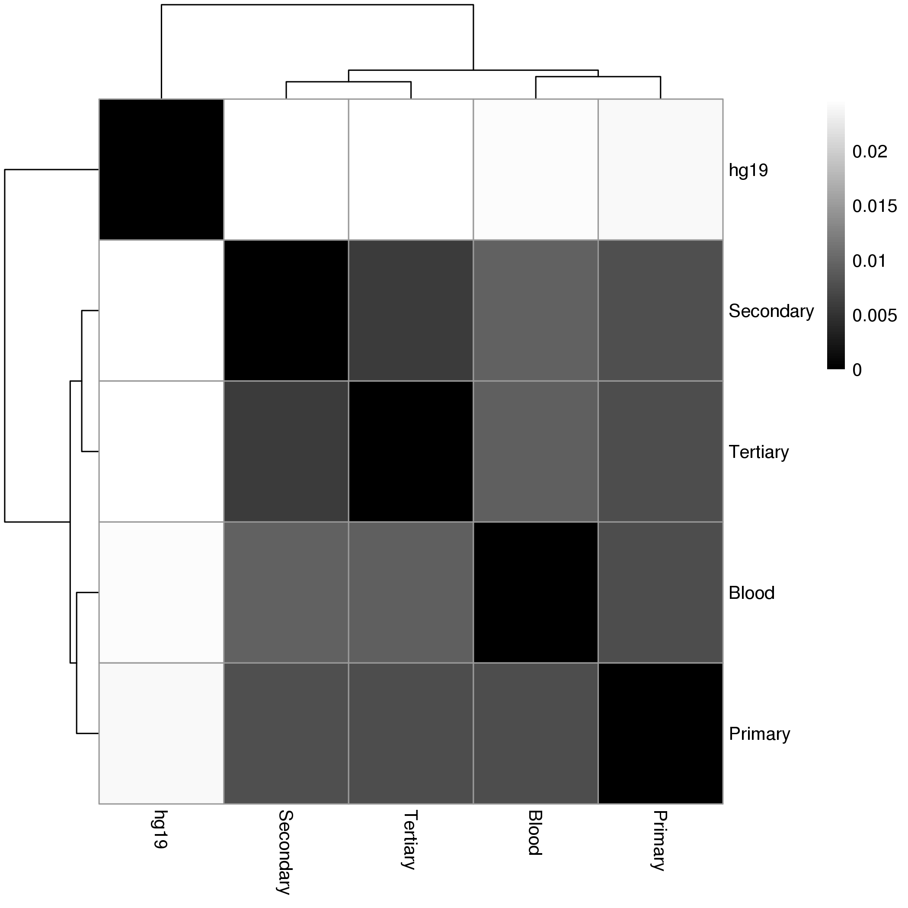
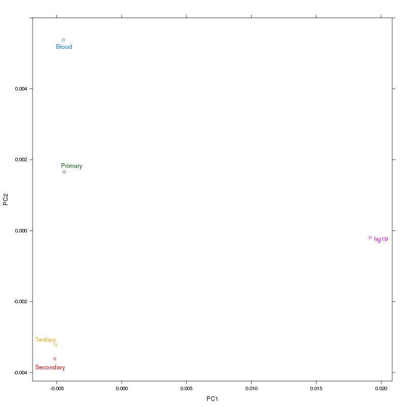
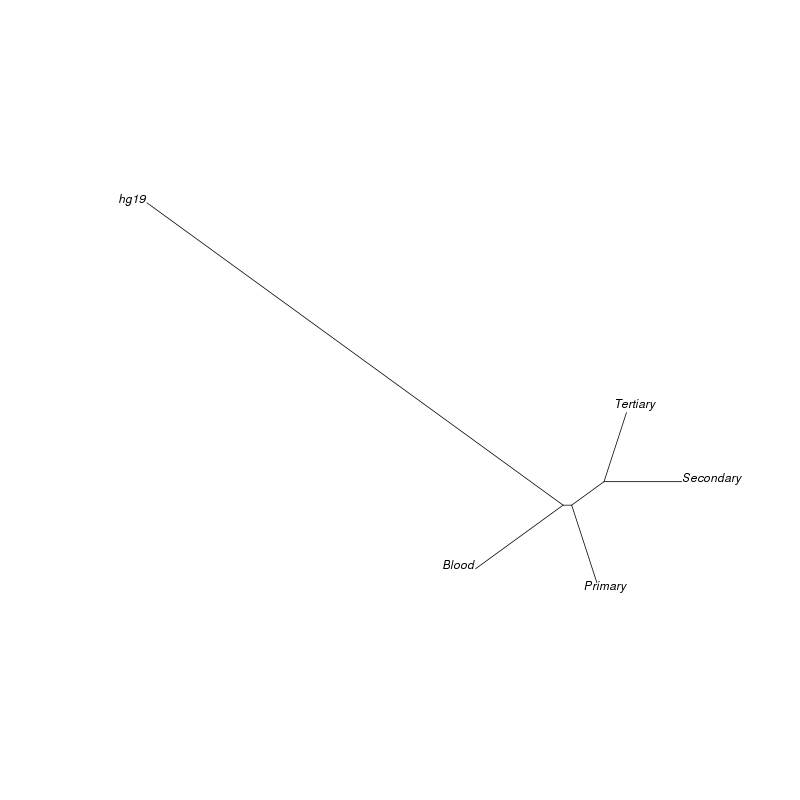

## Description

This folder contains a script that can be used to calculate the root-mean-square deviation (RMSD) of variant-allele frequencies between two samples.

For further questions please contact [@jiwoongbio](https://github.com/jiwoongbio).


## Requirements

1. Perl - https://www.perl.org
2. SAMtools - http://samtools.sourceforge.net or http://www.htslib.org
3. R - http://www.r-project.org


## Example commands

```
# Generate a pileup file from multiple BAM files
samtools mpileup -q 1 -f hg19.fasta Blood.bam Primary.bam Secondary.bam Tertiary.bam | gzip > osteosarcoma.pileup.gz

# Calculate RMSD values from a pileup file
perl pileup.rmsd.vaf.pl -d 10 osteosarcoma.pileup.gz > osteosarcoma.rmsd.txt

# Generate various plots using RMSD values
Rscript rmsd.plots.R osteosarcoma.rmsd.txt osteosarcoma Blood Primary Secondary Tertiary hg19
```


## Example plots

1. Heatmap


2. Multidimensional scaling


3. Minimum evolution tree



## Citation

A novel TP53-KPNA3 translocation defines a de novo treatment-resistant clone in osteosarcoma.
Cold Spring Harbor molecular case studies. 2016 Sep;2(5):a000992.
http://molecularcasestudies.cshlp.org/content/2/5/a000992.full
